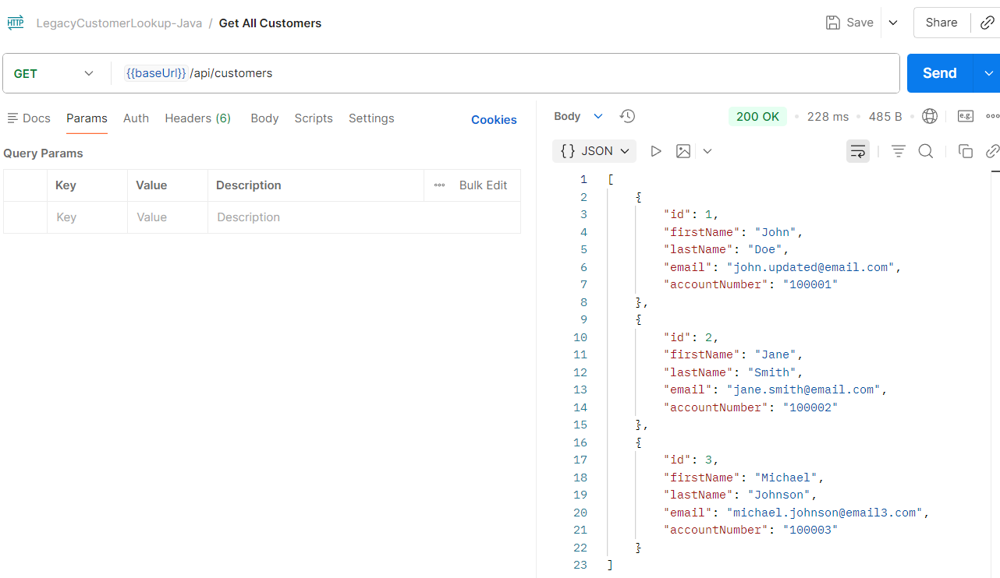
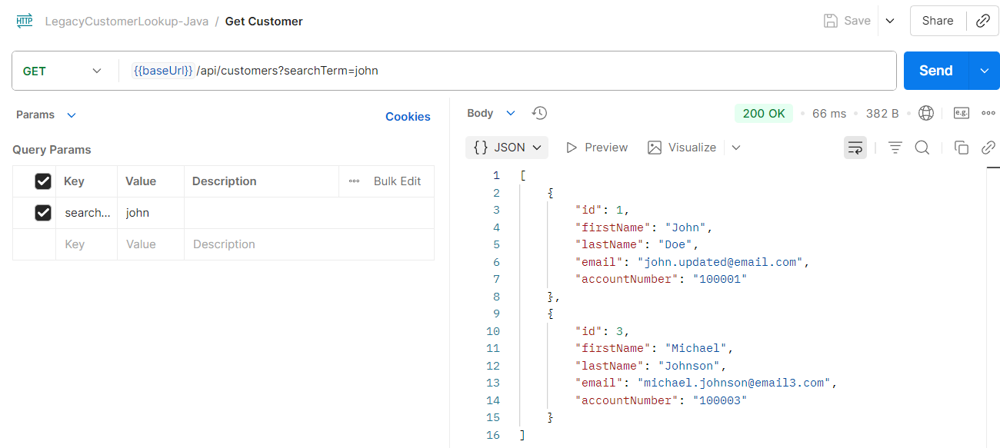
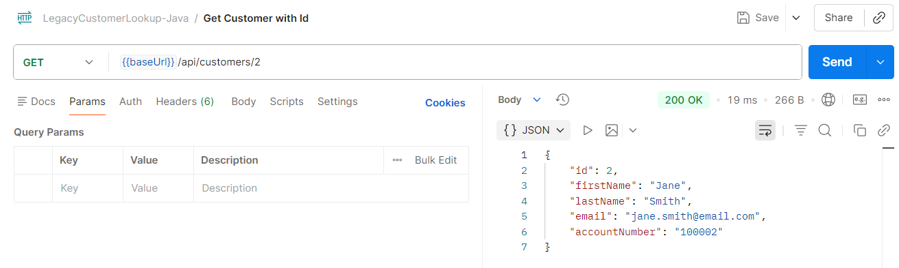
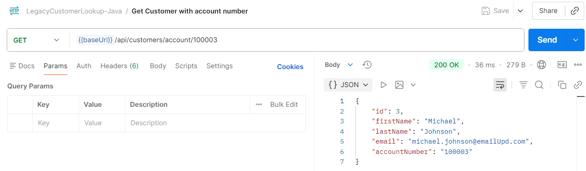
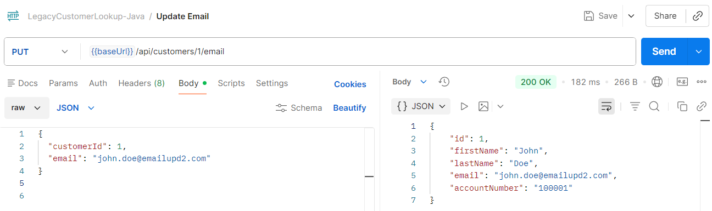
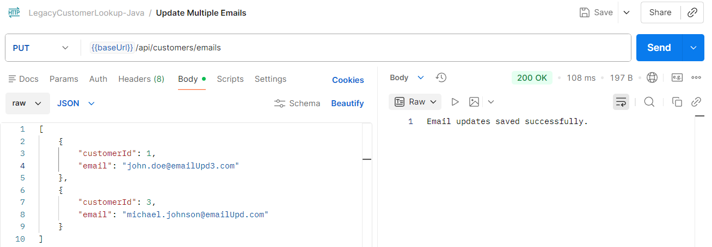
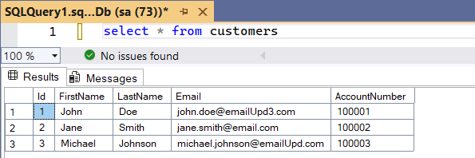
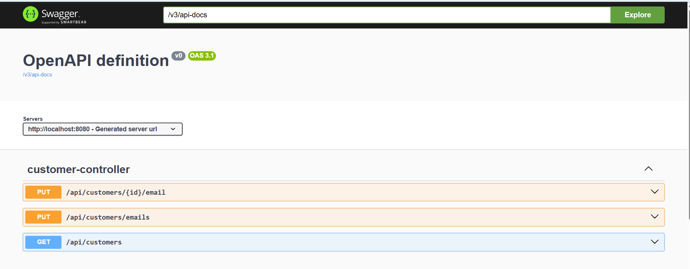

# Customer Lookup Java API

A Java 17 Spring Boot REST API that demonstrates enterprise-style customer lookup, SQL Server integration, layered backend architecture, and customer email maintenance.

## Features

- Retrieve all customers
- Search customers by name, email, or account number
- Retrieve customer by ID
- Retrieve customer by account number
- Update customer email address
- Validate email format
- Prevent duplicate email addresses
- SQL Server persistence
- JPA/Hibernate ORM
- Swagger/OpenAPI documentation
- Postman-tested REST endpoints

## Architecture

```text
Client / Postman / Swagger UI
        ↓
CustomerController
        ↓
CustomerService
        ↓
CustomerRepository
        ↓
SQL Server
```

---

## API Documentation

After running the application, open:

```text
http://localhost:8080/swagger-ui.html
```
API Endpoints

```text
Method	Endpoint	                                              Description
GET	/api/customers	                                              Get all customers
GET	/api/customers?searchTerm        	                          Get customer with name, email address, id or account number
GET	/api/customers/api/customers/{id}                             Get customer with Id
GET	/api/customers/api/customers/account/{accountNumber}          Get customer with account number
PUT	/api/customers/{id}/email	                                  Update customer email address
PUT	/api/customers/emails	                                      Update multiple customer email addresses
```
---

# API Endpoints
## Get All Customers

GET

```text
http://localhost:8080/api/customers
```

## Search Customers

GET

```text
http://localhost:8080/api/customers?searchTerm=john
```

## Update Customer Email

PUT

```text
http://localhost:8080/api/customers/1/email
```

Request Body:

```text
{
  "customerId": 1,
  "email": "john.updated@email.com"
}
```
---

# SQL Server Configuration

## Update application.properties:

```text
spring.datasource.url=jdbc:sqlserver://localhost:1433;databaseName=YOUR_DATABASE;encrypt=true;trustServerCertificate=true
spring.datasource.username=YOUR_USERNAME
spring.datasource.password=YOUR_PASSWORD

spring.jpa.hibernate.ddl-auto=validate
spring.jpa.hibernate.naming.physical-strategy=org.hibernate.boot.model.naming.PhysicalNamingStrategyStandardImpl
```
---
# Run the Application
## Maven

```text
mvn spring-boot:run
```

## IntelliJ

Run:

```text
CustomerLookupApplication.java
```
Sample Response

```text
[
  {
    "id": 1,
    "firstName": "John",
    "lastName": "Doe",
    "email": "john.doe@email.com",
    "accountNumber": "100001"
  }
]
```

---

## API Postman Test Screenshots

### Get All Customers



### Search Customer with the customer's name



### Search Customer with the id



### Search Customer with the account number



### Update Customer Email addrress



### Update Muitlple Customer Email addresses




## SQL Server Result After Update



# Swagger UI



